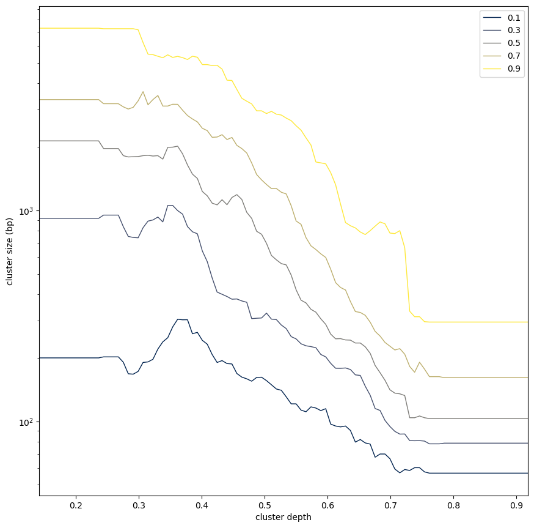

# ChIP-ARC: ChIP **A**daptive **R**ead **C**lustering

---

1. Chromatin binding/patterning is multi-scale
2. HDBScan to describe multi-scale aggregation
3. Preliminary results

---

---

## ChIPseq data

---

---

## Read-level clustering

---

---

## Leveraging controls to estimate significance

---

---
### A model to correct for confounding factors

- Model describing how confounding can predict observed read density
    - $obs.count_{i} \sim control.count_{i}$
- GAM regression
    - direction of "error" will indicate denser or sparser interaction than expected

---

---

## Cluster Replicability

---

### Quantifying cluster convergence
- Similar regions -> Jaccard
- Similar shape -> Cramer von Mises

---

---

---

### Illustrative results

---

---

## aggregation along scale

---
### CTCF aggregates span different scales

---

### H3K27me3 aggregates remain at the same scale

---

## Perspective

- How do conventional TFBS populate this broader binding landscape ?
- Are there other sequence determinants shaping these novel aggregates ?
- How constitutive is the balance between narrow and broad binding across factors and samples?